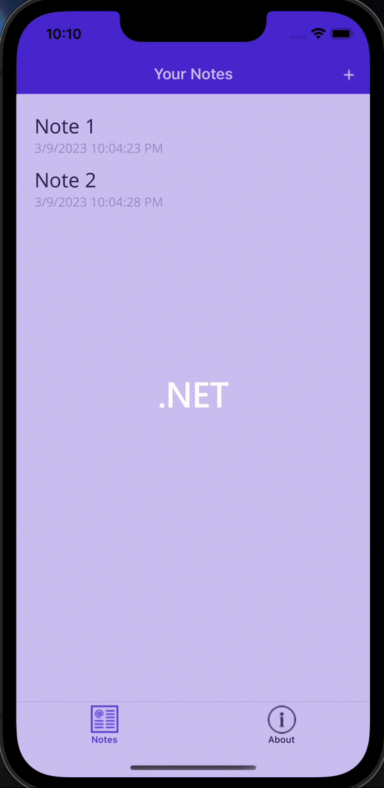

# MAUI Tutorial: Notes App

### Description
A simple cross-platform application written in C# and XAML with .NET MAUI.
Created by following the following tutorial: [Create a .NET MAUI App](https://learn.microsoft.com/en-us/dotnet/maui/tutorials/notes-app/?view=net-maui-7.0)

### Demo

